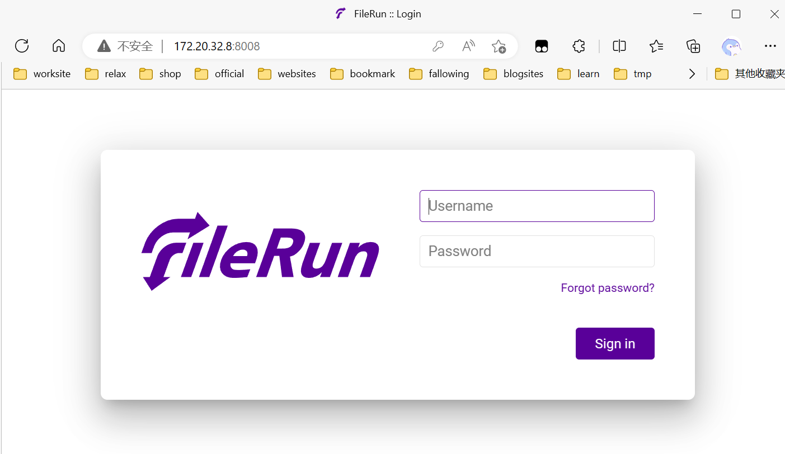

# 自定义hosts以访问服务器

**若还没有配置hosts, 请先前往[hosts配置](#2-hosts-配置), 自定义hosts以访问下列服务器内容**

>  暂时没时间，简陋点，等有空了改个好看点的门户网站

# 1. 以下是引导内容

---


# <a href="http://115b.net:2233" target="_blank">柒柒的小破站</a>

---

# <a href="http://115b.net:8008/" target="_blank">媒体服务器</a>

```
 有两个公共账户:
 1. 只读,主要内容是各种安装包
用户名：
    resource
密码：
    123

 2. 可读写,主要用作网络临时交换存储空间
 这个账户对应的存储空间也有简易的直接浏览和下载的web网页服务, IIS提供的目录浏览, 链接点击下面的目录浏览
 http://115b.net:8008/
用户名：
    a
密码：
    a
```
[目录浏览](http://115b.net:8008/)



---

# <a href="http://115b.net:9001" target="_blank">OSS 对象存储服务</a>

---

# 2. hosts 配置 

## 2.1. Android 配置

配合 virtual-hosts 使用 ,

- [virtual-hosts github项目](https://github.com/x-falcon/Virtual-Hosts) 
- [virtual-hosts.apk (我的国内云空间存储， 如果上面那个很慢进不去就点这个下载)](https://sayurinana-aliyun-oss.oss-cn-beijing.aliyuncs.com/package/apk/virtual-hosts.apk)

供 virtual-hosts 使用的远程hosts文件 :

[https://sayurinana.github.io/hosts/hosts](https://sayurinana.github.io/hosts/hosts)

演示视频：

<video src="https://sayurinana-aliyun-oss.oss-cn-beijing.aliyuncs.com/video/virtual-hosts%E6%93%8D%E4%BD%9C%E6%BC%94%E7%A4%BA.mp4" controls="controls" width="540px" height="960px"></video>

## 2.2. Windows 配置

编辑添加[hosts内容](#3-hosts-内容)

`C:\Windows\System32\drivers\etc\hosts`

## 2.3. Linux/Unix/类Unix 配置

编辑添加[hosts内容](#3-hosts-内容)

`/etc/hosts`

## 2.4. MacOS/iOS 配置

> 别看,不知道

---

# 3. hosts 内容

更新时间: 

当前的hosts内容

```
172.20.32.26                115b.net
172.20.32.26                wuuuu.115b.net
172.20.32.26                blog.wuuuu.115b.net
172.20.32.26                minio.server.115b.net
```

---
