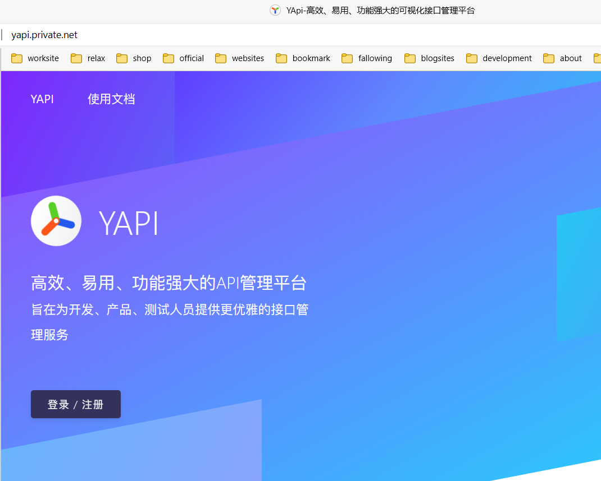
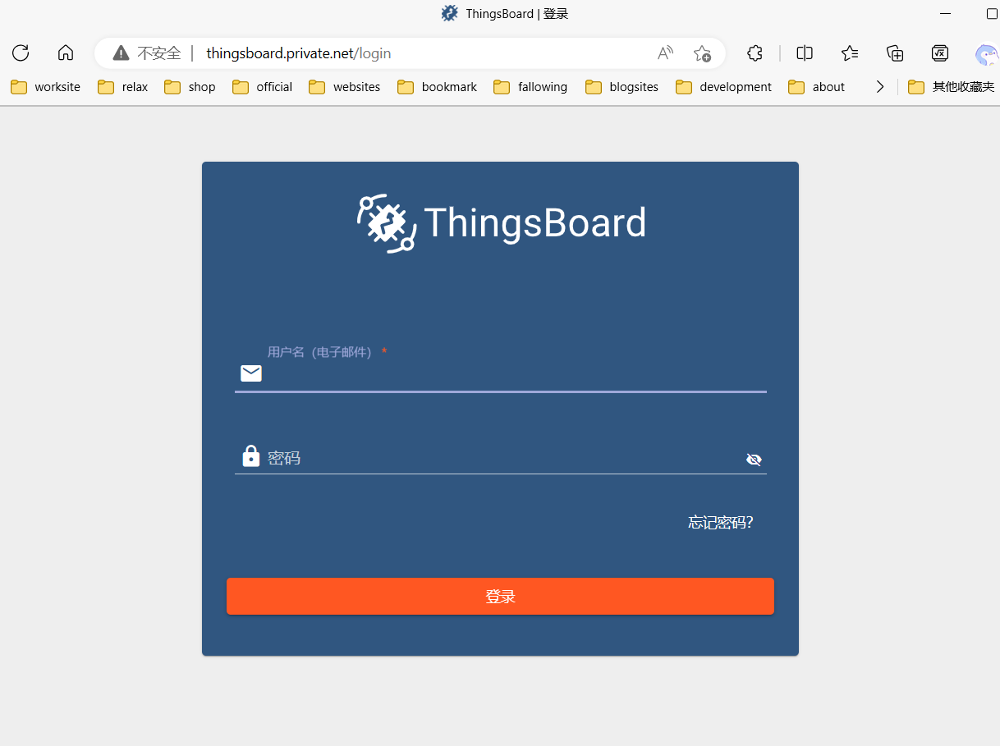
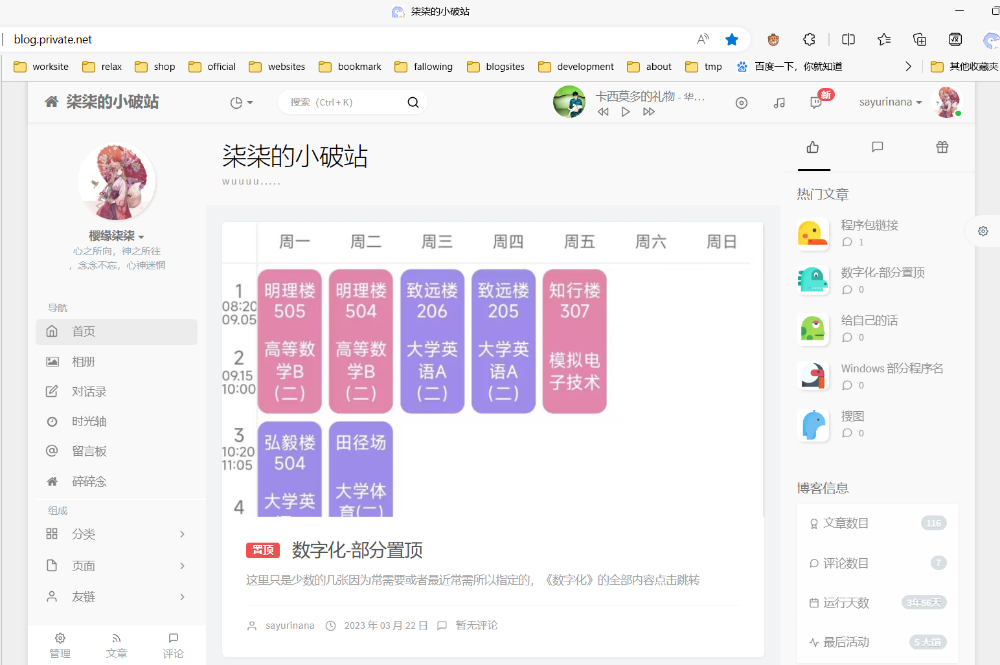
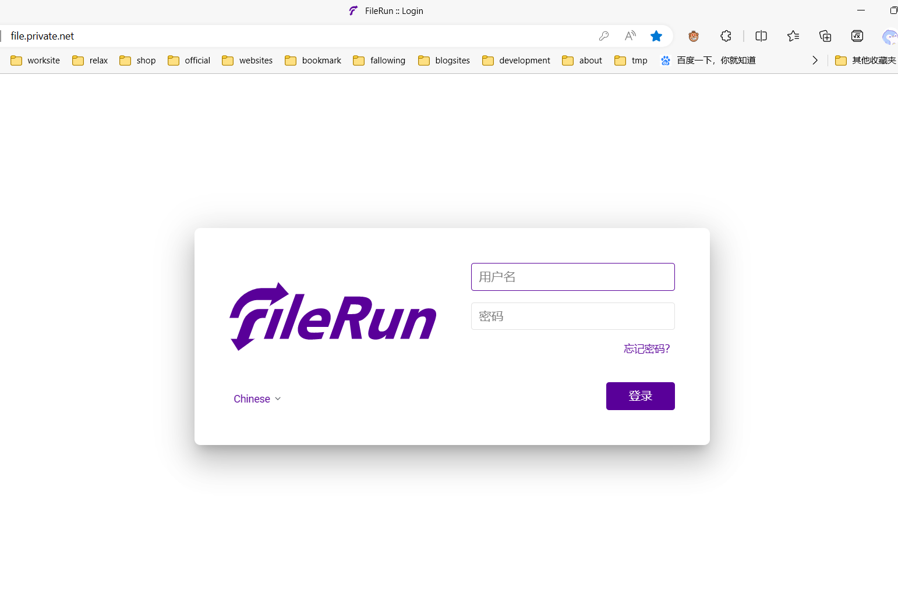
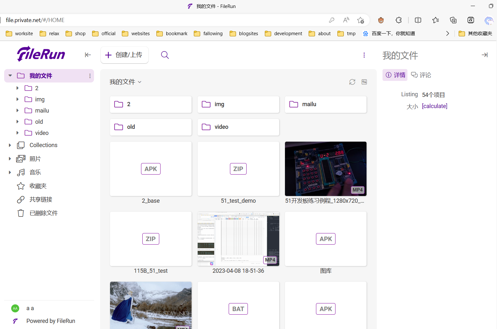
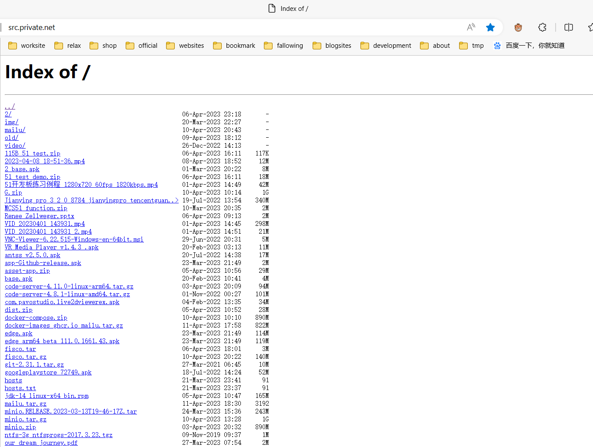
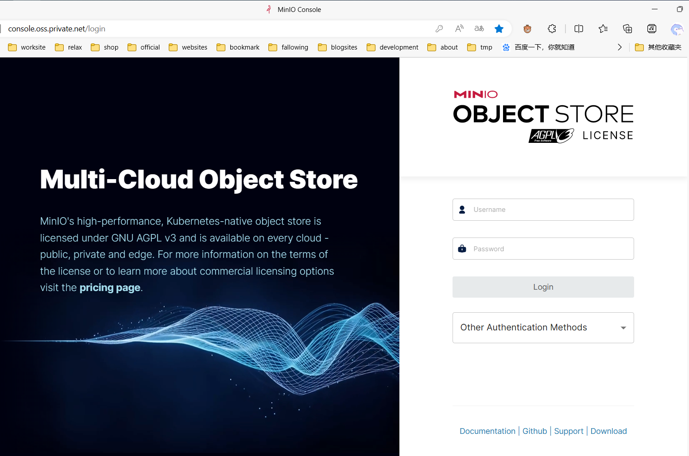
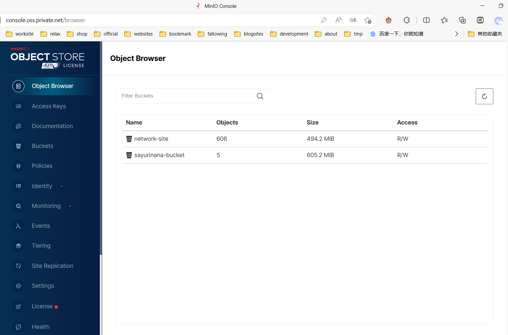
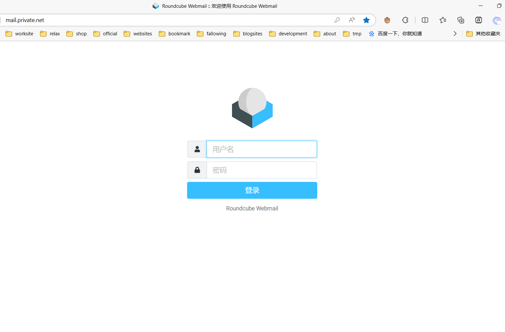
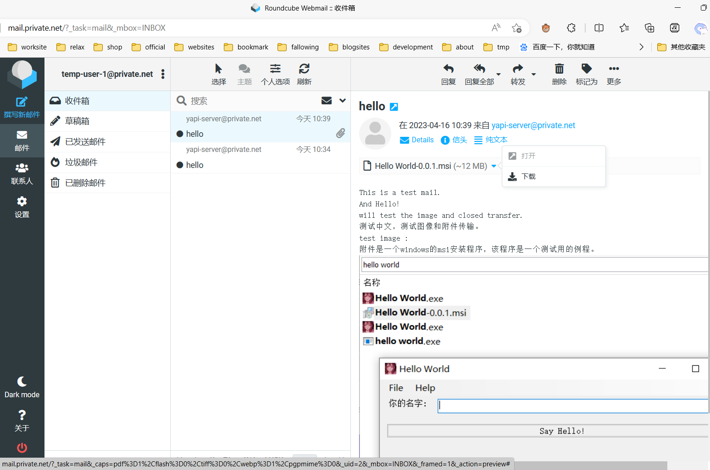

[toc]

# 自定义hosts以访问服务器

**若还没有配置hosts, 请先前往[hosts配置](#2-hosts-配置), 自定义hosts以访问下列服务器内容**

>  暂时没时间，简陋点，等有空了改个好看点的门户网站

# 1. 以下是Web引导

---

# <a href="http://yapi.private.net/" target="_blank">YApi-高效、易用、功能强大的可视化接口管理平台 (private.net)</a>



---

# <a href="http://thingsboard.private.net/login" target="_blank">IoT平台 ThingsBoard | 登录 (private.net)</a>



# <a href="http://blog.private.net/" target="_blank">柒柒的小破站</a>



---

# <a href="http://file.private.net/" target="_blank">文件服务器</a>

```
 有两个公共账户:
 1. 只读,主要内容是各种安装包
用户名：
    resource
密码：
    123

 2. 可读写,主要用作网络临时交换存储空间
 这个账户对应的存储空间也有简易的直接浏览和下载的web网页服务, IIS提供的目录浏览, 图示在下一部分目录浏览
 http://src.private.net/
用户名：
    a
密码：
    a
```




# <a href="http://src.private.net/" target="_blank">目录浏览(对应文件服务器的公共账户a的空间)</a>



---

# <a href="http://console.oss.private.net/" target="_blank">OSS 对象存储服务 （Web控制台）</a>

> 但是这个东东没有公用账户,
>
> 如果想用一下的话, 可以联系比如说[mail一下](mailto:sayurinana@163.com)说要做什么然后给开个账户





# <a href="http://mail.private.net/" target="_blank">Web 邮箱客户端 :: 欢迎使用 Roundcube Webmail (仅用于登录@private.net邮箱)</a>

> 有九个临时邮箱，若需要建立一个可以[mail一下](mailto:sayurinana@163.com)给开一个，
>
> 邮箱附件最大20MB，若要分享大文件建议通过文件服务器，
>
> 按   名称|地址|密码|空间|单位 格式列出：
> temp-user-1 | temp-user-1@private.net | ABCabc123 | 10 | MB
> temp-user-2 | temp-user-2@private.net | ABCabc123 | 10 | MB
> temp-user-3 | temp-user-3@private.net | ABCabc123 | 10 | MB
> temp-user-4 | temp-user-4@private.net | ABCabc123 | 10 | MB
> temp-user-5 | temp-user-5@private.net | ABCabc123 | 10 | MB
> temp-user-6 | temp-user-6@private.net | ABCabc123 | 10 | MB
> temp-user-7 | temp-user-7@private.net | ABCabc123 | 10 | MB
> temp-user-8 | temp-user-8@private.net | ABCabc123 | 10 | MB
> temp-user-9 | temp-user-9@private.net | ABCabc123 | 10 | MB





---

# 2. hosts 配置 

## 2.1. Android 配置

配合 virtual-hosts 使用 ,

- [virtual-hosts github项目](https://github.com/x-falcon/Virtual-Hosts) 
- [virtual-hosts.apk (我的国内云空间存储， 如果上面那个很慢进不去就点这个下载)](https://sayurinana-aliyun-oss.oss-cn-beijing.aliyuncs.com/package/apk/virtual-hosts.apk)

供 virtual-hosts 使用的远程hosts文件 :

[https://sayurinana.github.io/hosts/hosts](https://sayurinana.github.io/hosts/hosts)

演示视频（1是安装软件，2是补充的修改hosts文件的方法）：（视频里的地址有误，具体地址使用上面这个链接）

1. 

<video src="https://sayurinana-aliyun-oss.oss-cn-beijing.aliyuncs.com/video/virtual-hosts%E6%93%8D%E4%BD%9C%E6%BC%94%E7%A4%BA.mp4" controls="controls" width="540px" height="960px"></video>

2. 

<video src="https://sayurinana-aliyun-oss.oss-cn-beijing.aliyuncs.com/video/virtual-hosts%E4%BF%AE%E6%94%B9%E8%BF%9C%E7%A8%8Bhosts%E6%96%87%E4%BB%B6%E6%BC%94%E7%A4%BA.mp4" controls="controls" width="540px" height="960px"></video>

## 2.2. Windows 配置

编辑添加[hosts内容](#3-hosts-内容)

`C:\Windows\System32\drivers\etc\hosts`

## 2.3. Linux/Unix/类Unix 配置

编辑添加[hosts内容](#3-hosts-内容)

`/etc/hosts`

## 2.4. MacOS/iOS 配置

> 别看,不知道

---

# 3. hosts 内容

更新时间: 

当前的hosts内容

```
#对旧URL兼容
139.9.44.8                                 115b.net
139.9.44.8                           wuuuu.115b.net
139.9.44.8                      blog.wuuuu.115b.net
139.9.44.8                    minio.server.115b.net


139.9.44.8                              private.net
192.168.137.1                       wuuuu.private.net
192.168.137.210       vm-centos7-server-1.private.net
139.9.44.8                          src.private.net
139.9.44.8                         mail.private.net
139.9.44.8                          oss.private.net
139.9.44.8                         yapi.private.net
139.9.44.8                         blog.private.net
139.9.44.8                  thingsboard.private.net
139.9.44.8                   sayurinana.private.net
139.9.44.8                bt.sayurinana.private.net
139.9.44.8              blog.sayurinana.private.net
139.9.44.8              code.sayurinana.private.net
 ```

---
