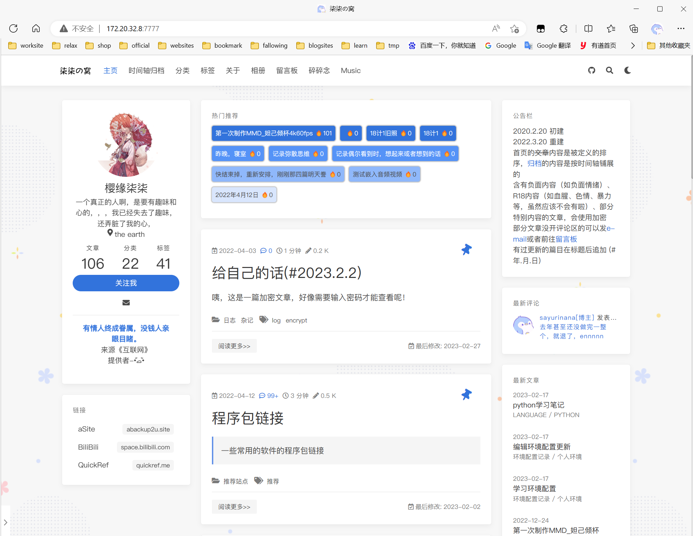

# hosts 

配合 [virtual-hosts](https://github.com/x-falcon/Virtual-Hosts) 使用的文件

# [自定义的hosts, 点击下载](./hosts)

更新时间: 

当前的hosts内容

```
172.20.32.11 115b.net
172.20.32.11 blog.wuuuu.115b.net
172.20.32.11 minio.server.115b.net
```

---

>  暂时没时间，简陋点，等有空了改个好看点的门户网站

以下是引导内容

---

远程hosts文件

[hosts (sayurinana.github.io)](https://sayurinana.github.io/hosts/)

`https://sayurinana.github.io/hosts/`

# <a href="http://blog.wuuuu.115b.net:2233" target="_blank">柒柒的小破站</a>


# <a href="http://115b.net:8008/" target="_blank">媒体服务器</a>

> 有两个公共账户:
>
> 1. 
>
>    用户名：
>
>    resource
>
>    密码：
>
>    123
>
> 2. 
>
>    用户名：
>
>    a
>
>    密码：
>
>    a


# <a href="http://115b.net:9001" target="_blank">OSS 对象存储服务</a>

# <a href="http://115b.net:7777/" target="_blank">柒柒の窝</a>


